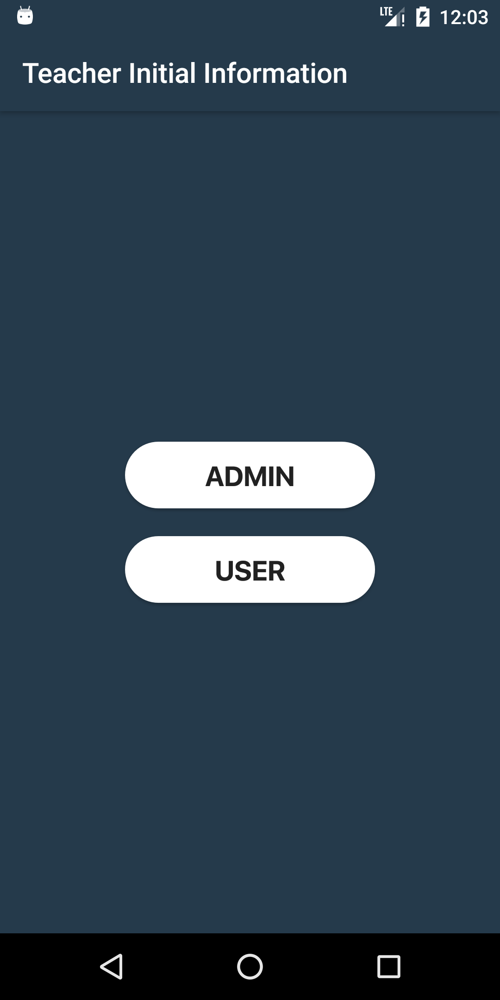
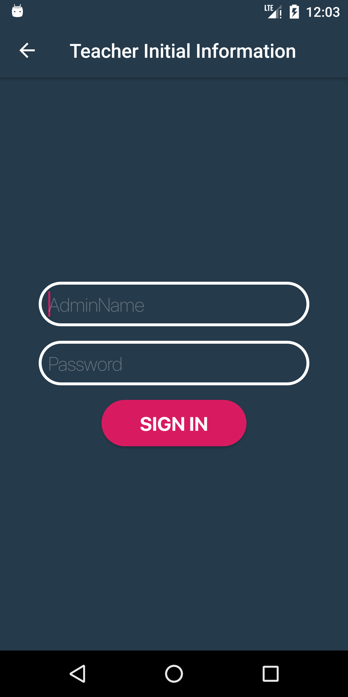
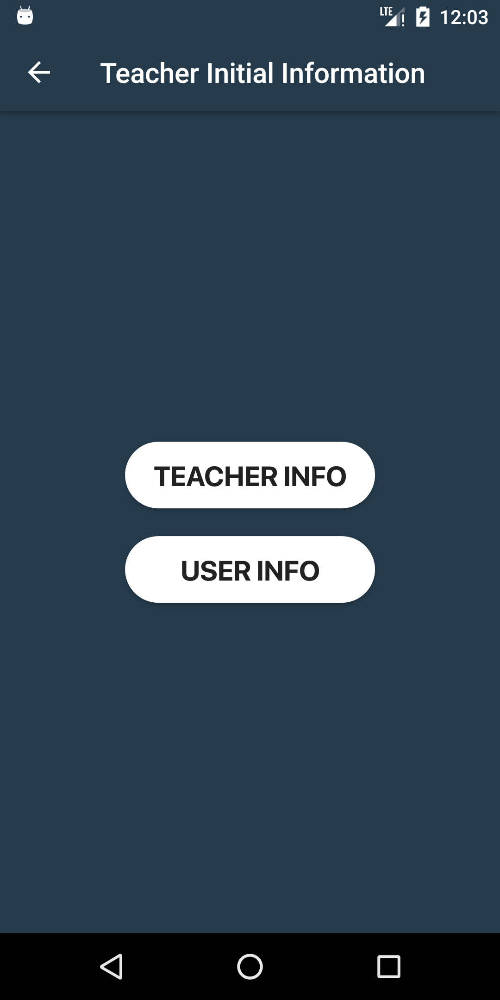
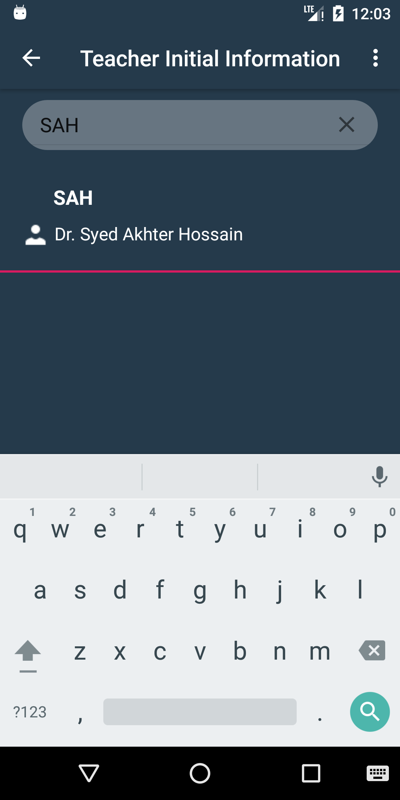
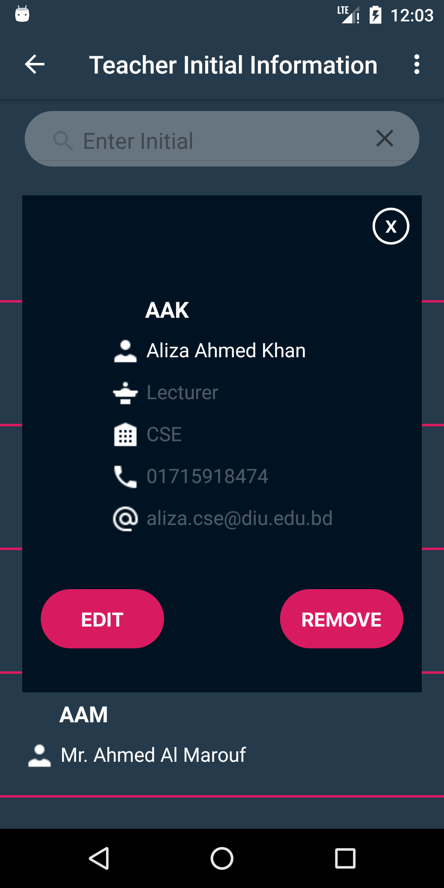
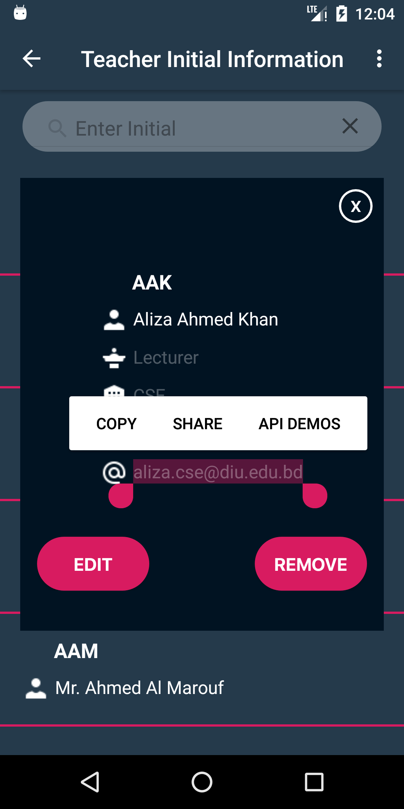
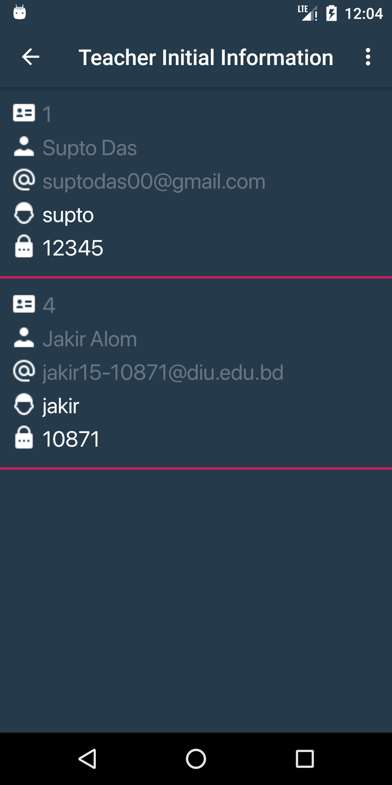

# DIU_Teacher_Initial_Information
This is an andorid apps which is made for Database Management System Course. 

# Features
- User can create user account and show the teacher information
- User can find teacher information search by teacher initial

# Use Tools
- Android Studio (XML + Java)
- SQLite Database

# Screen Shots

    

    

    

<h1>Download Link</h1>

<a href="https://github.com/supto-das/DIU_Teacher_Initial_Information/blob/master/app-debug.apk">Download</a>
